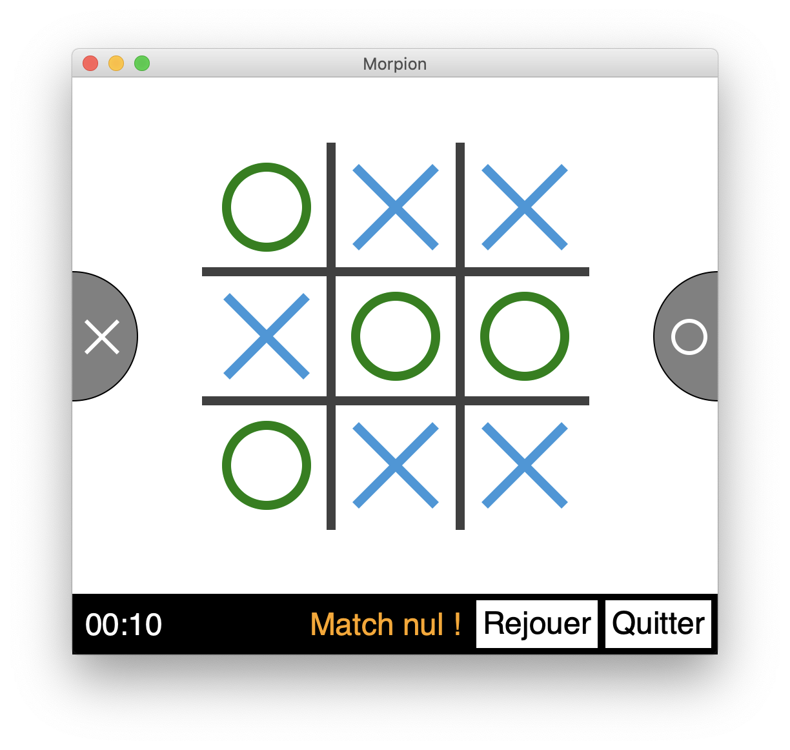

# TicTacToe

This game is written in Python using the `upemtk` library from the University of Marne-la-Vallée in France.

## Rules

The goal is to place 3 marks in a vertical, horizontal, or diagonal row.

## Screenshots

